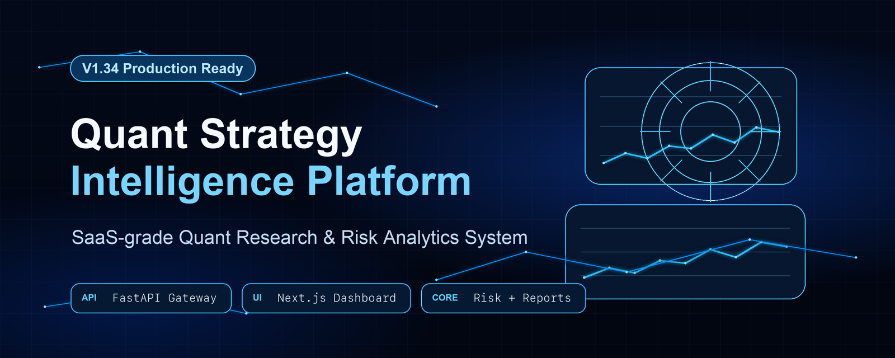
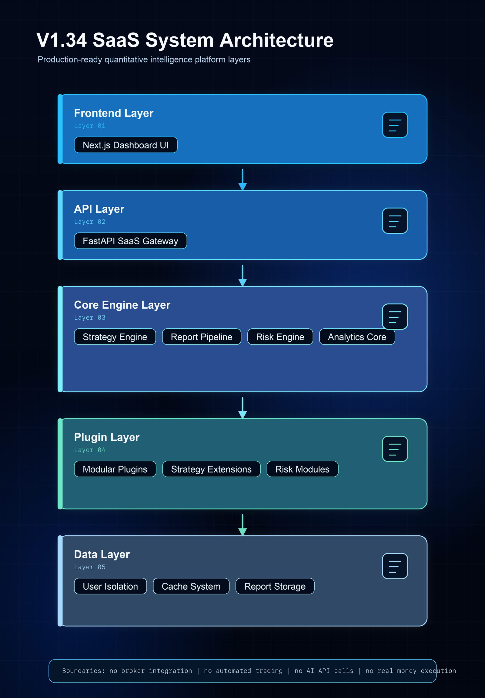

# 🧠 Quant Strategy Intelligence Platform (V1.34)

> A production-grade SaaS platform for quantitative strategy intelligence, risk analytics, and automated reporting systems.

A production-ready SaaS-style platform for quantitative strategy research, risk analysis, and automated reporting.

Turn raw market data into structured strategy intelligence with modular analytics, risk scoring, and automated reporting pipelines.

---

## 🚀 What This Platform Does

- 📊 Generate structured strategy research reports automatically  
- ⚠️ Evaluate strategy risk and stability with scoring engine  
- 📈 Compare multiple strategies side-by-side  
- 🧠 Track strategy performance over time  
- 📦 Modular plugin-based analytics architecture  
- 🌐 API-first SaaS architecture design  

---

## 🚀 How It Works

1. Select a trading strategy  
2. System generates structured analysis report  
3. Risk engine evaluates performance stability  
4. Dashboard visualizes insights  
5. Compare multiple strategies in real time  

---

## 🏗️ System Architecture

---

## 📊 Core Features

### 📈 Strategy System
- Modular strategy analysis engine
- Backtest-ready architecture
- Extensible design for research workflows

### 📊 Report Engine
- StandardReportV1 structured output
- Automated report generation pipeline
- Quality scoring system
- Stability evaluation metrics

### ⚠️ Risk Engine
- Risk scoring system
- Drawdown analysis
- Strategy stability evaluation
- Stress testing framework

### 📊 Dashboard
- Strategy overview panel
- Performance analytics
- Risk visualization
- System monitoring view

### 🔌 Plugin Architecture
- Modular plugin system
- Independent execution modules
- Extensible analytics components
- Clean separation of concerns

---

## ☁️ SaaS Capabilities

- Multi-user architecture (logical isolation)
- Role-based access control (RBAC)
- API key system design
- Subscription model structure (Free / Pro / Team)
- Plugin extensibility system

---

## 🌐 API Layer

- `/api/report/generate`
- `/api/report/list`
- `/api/report/detail`
- `/api/dashboard/summary`
- `/api/trend`
- `/api/risk`
- `/api/compare`

---

## 🧰 Tech Stack

- Frontend: Next.js
- Backend: FastAPI
- Architecture: Modular SaaS Design
- Testing: Pytest
- Deployment: Docker-ready structure

---

## 🗄️ V2.0 Production Data Foundation

- SQLite local database foundation at `data/shandong_v2.db`
- PostgreSQL-ready configuration structure without requiring PostgreSQL locally
- User, StrategyReport, ApiKey, BillingPlan, and AuditLog data models
- Repository layer for user, report, API key, billing, and audit data
- Archive-to-database importer for V1 local report archives
- Backward compatible with `reports/strategy_research_reports/`
- API v2 database health and read-only data endpoints
- API keys are stored as hashes only, never plaintext
- No broker connection, no auto trading, no AI API, no real payment execution

---

## 🛡️ V2.1 API Production Hardening

- Production API response standard for success and error payloads
- Error handling layer with sanitized messages and details
- Request validation for user IDs, report generation, and pagination
- Pagination utilities with bounded `page_size` up to 100
- CORS middleware for local UI origins and configurable allowed origins
- Basic in-memory rate limiting for local production structure
- API logging with sensitive data sanitization and audit-log fallback
- Enhanced DB health response with database type and warning details
- Preserves the V2.0 database foundation and existing API paths
- No broker connection, no auto trading, no AI API, no real payment execution, no plaintext secrets

---

## 🔐 V2.2 Auth / User Session Hardening

- Auth context for API requests
- Session service with hashed stored session values and revoke support
- Permission service with admin / user / viewer RBAC defaults
- API key verification service with hash-only storage
- Auth middleware helpers for `X-User-ID`, `X-Session-ID`, and `X-API-Key`
- Local mock login / logout / me endpoints
- RBAC checks on report, dashboard, risk, and admin API routes
- Auth audit logs with sensitive data sanitization
- Current login flow is local mock login, not a real production identity provider
- No real passwords, no plaintext session values, no plaintext API keys
- No broker connection, no auto trading, no AI API, no real payment execution
- Core strategy logic unchanged

---

## 🔒 V2.3 Production Auth Mode & Security Policy

- Configurable auth modes: `local`, `dev`, and `production`
- Production security policy layer for auth requirement, session TTL, API-key requirement, and local-admin fallback control
- Local mode keeps the existing default-admin fallback for local development
- Dev mode supports mock session / API-key flow without anonymous admin promotion
- Production mode requires a valid session or API key for protected endpoints
- Protected API routes return standard 401 / 403 errors for missing, invalid, or insufficient auth
- `/api/v2/system/security-health` exposes sanitized security-policy status
- Audit logging records auth mode, required auth, invalid credentials, permission denial, and policy checks
- Security sanitizer removes sensitive values, raw tokens, raw keys, authorization headers, database paths, and local absolute paths
- Mock login remains mock-only and reports `mock_auth_only` in production mode
- No broker connection, no auto trading, no AI API, no real payment execution, no plaintext secrets
- Core strategy logic unchanged

---

## 🧪 System Status

- ✔ pytest: 420+ tests passed  
- ✔ system doctor: OK  
- ✔ API health: OK  
- ✔ frontend build: OK  
- ✔ architecture: production-ready SaaS design  

---

## 🚫 Constraints

- No broker integration  
- No automated trading  
- No real-money execution  
- No external AI API calls  
- No financial advice generation  

---

## 📌 Version Status

V1.34 = Production-ready SaaS architecture foundation  
✔ Backend stable  
✔ Frontend ready  
✔ API layer complete  
✔ Plugin system implemented  
✔ Risk & report engine functional  

---

## 🧠 Design Philosophy

- Modular architecture  
- Plugin-based extensibility  
- SaaS-ready system design  
- Separation of concerns  
- Production-first structure  

---

## 🚀 Summary

This project demonstrates a full SaaS-style quantitative intelligence system architecture, covering:

- Strategy research system design  
- Risk analytics engine  
- Report automation pipeline  
- Scalable API layer  
- Plugin-based extensibility  
- SaaS-ready architecture foundation  
